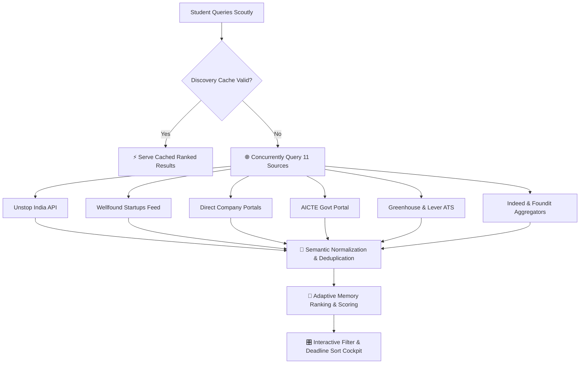
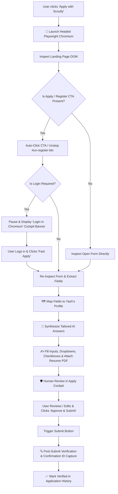

<div align="center">

# 🦅 Scoutly
### **Autonomous AI Browser Agent for Student Internship Discovery, Hackathons & Verified Applications**

[](https://www.typescriptlang.org/)
[](https://reactjs.org/)
[](https://playwright.dev/)
[](https://nodejs.org/)
[](https://vitejs.dev/)
[](https://tailwindcss.com/)

<p align="center">
  <b>Scoutly</b> is a privacy-first, autonomous AI agent that concurrently scouts <b>11+ live student platforms</b> (Unstop, Wellfound, Direct Portals, AICTE, Greenhouse, Lever, etc.), discovers national <b>hackathons & technical bootcamps</b>, learns student preferences over time, and uses <b>headed Playwright Chromium</b> to auto-fill applications, attach resumes, synthesize grounded AI responses, and request final approval in an interactive <b>Human-in-the-Loop Cockpit</b>.
</p>

[✨ Key Features](#-key-features) •
[🏗️ System Architecture](#️-system-architecture) •
[🔄 Workflows & Flowcharts](#-workflows--flowcharts) •
[💻 Tech Stack](#-tech-stack) •
[🚀 Quickstart](#-getting-started) •
[🎯 Judge Demo Mode](#-judge-demo-mode) •
[🛡️ Ethical Principles](#️-ethical--security-principles)

---

</div>

## 🌟 Key Features

### 🔍 1. Multi-Source Discovery Engine (11+ Concurrent Portals)
- **Concurrently queries 11 public job platforms** in parallel with non-blocking resilience (`Promise.allSettled`).
- **Live Connected Sources**:
  - 🌐 **Unstop India** (Live Public Search API & Quick Apply Feed)
  - 🌐 **Wellfound (AngelList Talent)** (Verified Live Startup Roles & Custom Questions)
  - 🌐 **Direct Company Career Portals** (Palantir, AMD, Figma, Microsoft, TikTok, Jane Street, etc.)
  - 🌐 **AICTE Government Internship Portal**
  - 🌐 **Greenhouse & Lever ATS Boards**
  - 🌐 **Indeed & Foundit India Aggregators**
- **Smart Normalization & Deduplication**: Cleans titles, normalizes modes (*Remote / Hybrid / Onsite*), parses stipends (*e.g., ₹18,000/mo, 15k-25k, $500*), and deduplicates across platforms using source-authority priority (*Direct ATS > Portals > Aggregators*).
- **Interactive Multi-Filter Cockpit**: Instant filtering by **Domain/Interest** (*Cybersecurity, AI/ML, Full Stack, DevOps, Data Science*), **Website Source**, **Work Mode**, and **Min Stipend**.
- **⏳ Deadline Sorting & Urgent Countdown Badges**:
  - Toggle sorting by **Best Match**, **Deadline (Ending Soonest)**, **Highest Stipend**, or **Newest**.
  - Dynamic visual countdown badges (*e.g. `⏳ 4 days left (Aug 26)`, `⏳ 12 days left (Sep 3)`*).

---

### 🎪 2. Student Events, Hackathons & Masterclasses
- **Beyond Internships Tab**: Dedicated showcase for high-impact student engineering milestones.
- **💻 National & Global Hackathons**:
  - **Smart India Hackathon (SIH 2026)** *(Ministry of Education & AICTE — ₹1,00,000 / Problem Statement)*
  - **ETHIndia 2026** *(Devfolio & Ethereum Foundation — $100,000+ Bounties, Bengaluru)*
  - **HackMIT 2026** *(MIT Tech Club — Global Student Track)*
- **🎓 Technical Workshops & Bootcamps**:
  - **Google Cloud GenAI & Agentic Workflows Workshop** *(GDG — Gemini 1.5 Pro & Vertex AI Credits)*
  - **Offensive Security & Threat Hunting Bootcamp** *(Nullcon & CyberPeace Foundation)*
  - **AWS Cloud & Serverless Masterclass** *(AWS User Group India)*
- **🏆 Competitions & PPO Innovation Tracks**:
  - **Asian Paints Alchemy 2026** *(Direct PPO Interview Track — ₹5,00,000 Prize Pool)*
  - **Microsoft Imagine Cup 2026** *(Microsoft Learn — $100,000 Global Award)*

---

### 🤖 3. Universal Playwright Browser Agent
- **Universal ATS & Platform Compatibility**: Works across **Wellfound, Unstop (`#un-register-btn`), Greenhouse, Lever, Workday, Ashby, SmartRecruiters, Indeed**, and direct company career portals.
- **Real Headed Chromium Automation**: Launches genuine Chromium browser windows right on your desktop.
- **Persistent Session Storage (`data/browser-user-data`)**: Saves cookies, local storage, and Google/OTP logins. Log in once on any portal—Scoutly remembers you for all future applications!
- **Auth Gate & Login Pause**: If an application requires login, Scoutly pauses and displays an interactive banner:  
  `[ 🔐 I've Logged In — Fast Apply 🚀 ]`. Once clicked, it resumes autofill immediately.
- **Multi-Tab & Popup Tracking**: Listens for newly opened popup windows and redirects, keeping focus on the active form tab.
- **Real PDF Resume Attachment**: Auto-detects and attaches `Resume/Yash_Harfode_Resume.pdf` to file upload inputs.
- **Comprehensive HTML Element Support**: Native handling for text inputs, `<textarea>`, `<select>` dropdowns, `input[type="checkbox"]` agreements, and `input[type="radio"]` work authorization toggles.

---

### 🧠 4. Grounded AI Answer Generator & Semantic Mapping
- **Profile-Grounded Answers**: Uses OpenRouter / Claude 3.5 Sonnet / Gemini 1.5 Pro to synthesize tailored, honest answers based strictly on the student's verified skills and project experience.
- **Anti-Hallucination Guardrails**: Prompts are constrained to never invent work experience, fake GPA, or fabricate credentials.
- **Deterministic Field Mapping**: Prioritizes verified student profile data (*First Name, Last Name, Email, Phone, College, Degree, GitHub, LinkedIn, Skills*) before generating subjective essays.

---

### 🛡️ 5. Human-in-the-Loop Apply Cockpit
- **Interactive Review Interface**: Inspect and edit mapped answers in real-time with instant UI updates.
- **Field-Level AI Regeneration**: Don't like a specific answer? Click `[ 🪄 Regenerate AI ]` for that specific field without re-running the entire application.
- **100% User Verification**: Scoutly never submits an application without explicit human approval.
- **Verified Reference ID Extraction**: Post-submission Heuristic scanner extracts Confirmation IDs, Application IDs, and reference numbers for complete audit trails.

---

### 💡 6. Self-Learning Adaptive Memory
- **Learns User Preferences**: Remembers which skills and roles you apply to most frequently.
- **Dynamic Re-Ranking**: Automatically boosts match scores and rankings for your preferred technologies in subsequent searches.

---

## 🏗️ System Architecture

```
┌────────────────────────────────────────────────────────────────────────┐
│                          REACT 18 FRONTEND                             │
│  Discover • Matches • Saved Cockpit • Events & Hackathons • Demo Mode  │
└──────────────────────────────────┬─────────────────────────────────────┘
                                   │  HTTP REST API / JSON
                                   ▼
┌────────────────────────────────────────────────────────────────────────┐
│                        EXPRESS TYPESCRIPT SERVER                       │
│  Routes: /api/search • /api/events • /api/apply • /api/profile         │
└──────┬───────────────────────────┬───────────────────────────────┬─────┘
       │                           │                               │
       ▼                           ▼                               ▼
┌──────────────┐         ┌────────────────────┐         ┌────────────────┐
│  DISCOVERY   │         │   AI SYNTHESIS     │         │   PLAYWRIGHT   │
│   ENGINE     │         │      ENGINE        │         │ BROWSER AGENT  │
│ 11+ Sources  │         │ OpenRouter/Claude  │         │ Headed Chrome  │
│ Deduplication│         │ Guardrails & Memory│         │ Heuristic DOM  │
└──────────────┘         └────────────────────┘         └────────────────┘
```

---

## 🔄 Workflows & Flowcharts

### 1. Multi-Source Discovery Pipeline



---

### 2. Autonomous Browser Apply Workflow



---

## 💻 Tech Stack

| Layer | Technologies |
|---|---|
| **Frontend UI** | React 18, Vite, TypeScript, TailwindCSS, Lucide React |
| **Backend Engine** | Node.js, Express, TypeScript, Zod Schema Validation |
| **Browser Automation** | Playwright (Headed Chromium with Persistent User Profile) |
| **Discovery Sources** | Unstop, Wellfound, AICTE, Greenhouse, Lever, Indeed, Foundit, Direct Portals |
| **AI Synthesis** | OpenRouter (Claude 3.5 Sonnet / Gemini 1.5 Pro / GPT-4o) |
| **Persistence** | Local JSON File Storage (`data/profile.json`, `data/saved.json`, `data/memory.json`) |
| **Automated Testing** | Node Test Runner, TSX, E2E Checkpoint Verification Suites |

---

## 🚀 Getting Started

### Prerequisites
- **Node.js** v18 or higher installed.
- **Google Chrome / Chromium** (installed automatically via Playwright).

### 1. Clone & Install
```bash
git clone https://github.com/yashharfode/Scoutly.git
cd Scoutly
npm run install:all
```

### 2. Configure Environment (Optional AI Key)
```bash
cp .env.example .env
```
*(Add `OPENROUTER_API_KEY=your_key` for live AI answer synthesis, or use built-in heuristic generation).*

### 3. Run Development Servers
```bash
# Terminal 1: Start Backend API (Port 3000)
npm run start --prefix backend

# Terminal 2: Start Frontend UI (Port 5173)
npm run dev --prefix frontend
```
Open **[http://localhost:5173](http://localhost:5173)** in your browser!

---

## 🎯 Judge Demo Mode

Scoutly includes a dedicated **Judge Demo Mode** pre-configured for live presentations and evaluations:

1. Click **`🎯 Judge Demo Mode`** in the top navigation bar or sidebar.
2. Explore 3 organized sections:
   - **🌐 Section 1: Verified Wellfound Roles** (*RentOk, Swift, TaskLabs, Gravity AI, Teal India, Alchemyst AI, LedgersCFO, Vitraga, ReferralWorld, Cravv, Mowka, RxGPT*).
   - **🇮🇳 Section 2: Verified Unstop India Roles** (*Cruvels, Vertawo Labs, PrepLinc, Marvedge, Tringflow, SpiralInfra, Rivyou, My Indian Things, Asian Paints*).
   - **🛡️ Section 3: Guaranteed Offline Playwright Sandbox** (*SecureStack Cybersecurity Analyst*).
3. Click **"Launch in Real Chromium"** on any card to watch Scoutly open real Chromium, auto-fill the application, attach your resume, and prompt for human approval!

---

## 🛡️ Ethical & Security Principles

- **No Blind Submissions**: Scoutly enforces strict human approval before any final application submit button is clicked.
- **Privacy-First Architecture**: All student profile data, resumes, and cookies remain 100% local on your machine (`data/`).
- **Grounded Responses**: AI answer generation uses constrained prompting to eliminate hallucinations and adhere strictly to real credentials.
- **Rate-Limit Conscious**: Public discovery sources use polite concurrency, user-agent identification, and responsive caching.

---

<div align="center">

Built with ❤️ by **[Yash Harfode](https://github.com/yashharfode/)** • *Scoutly AI Agent*

</div>

---

## 🚢 Deployment Guide

### Option 1: 1-Command Docker Compose (Full-Stack)
Run both Frontend & Backend with Playwright Chromium pre-installed:
```bash
docker compose up --build -d
```
- Frontend UI: `http://localhost` (or `http://localhost:5173`)
- Backend API: `http://localhost:3000`

---

### Option 2: Deploy Frontend on Vercel
1. Push your repository to GitHub.
2. Import the repository in [Vercel Dashboard](https://vercel.com).
3. Vercel will automatically detect `vercel.json` and build `frontend/dist`.
4. Set the Environment Variable:
   ```env
   VITE_API_URL=https://your-backend-service.onrender.com
   ```

---

### Option 3: Deploy Backend on Render (Docker Service)
1. In [Render Dashboard](https://render.com), create a **New Web Service**.
2. Connect your `Scoutly` GitHub repository.
3. Select **Docker** environment (it automatically detects the root `Dockerfile`).
4. Set Environment Variables:
   - `PORT=3000`
   - `NODE_ENV=production`
   - `BROWSER_MODE=playwright`
   - `MOCK_MODE=false`
   - `OPENROUTER_API_KEY=your_key` (optional)

---

### Option 4: Deploy Backend on Railway
1. In [Railway Dashboard](https://railway.app), create a **New Project** from GitHub repo.
2. Railway will automatically use `railway.json` and `Dockerfile`.
3. Add `PORT=3000` and generate your public domain.

