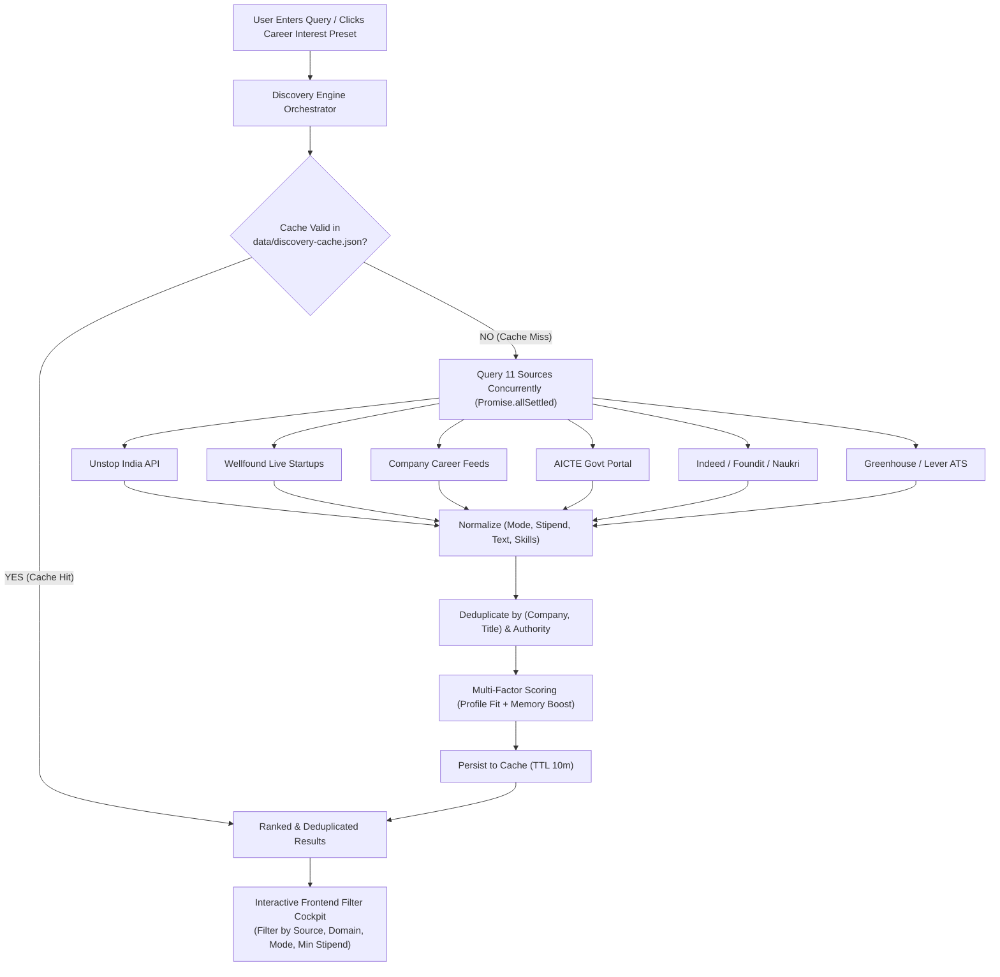
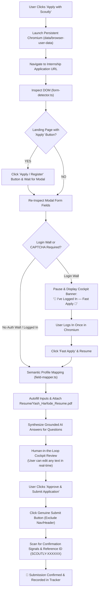

<div align="center">

# 🦅 Scoutly
### **Autonomous AI Browser Agent for Student Internship Discovery & Verified Applications**

[](https://www.typescriptlang.org/)
[](https://reactjs.org/)
[](https://playwright.dev/)
[](https://nodejs.org/)
[](https://vitejs.dev/)
[](https://tailwindcss.com/)

<p align="center">
  <b>Scoutly</b> is a privacy-first, autonomous AI agent that concurrently scouts <b>11+ live internship platforms</b> (Unstop, Wellfound, Company Portals, AICTE, Greenhouse, Lever, etc.), learns student preferences over time, and uses <b>headed Playwright Chromium</b> to auto-fill applications, attach resumes, synthesize grounded AI responses, and request final approval in an interactive <b>Human-in-the-Loop Cockpit</b>.
</p>

[✨ Live Features](#-key-features) •
[🏗️ Architecture](#️-system-architecture) •
[🔄 Flowcharts](#-workflow-diagrams) •
[💻 Tech Stack](#-tech-stack) •
[🚀 Quickstart](#-getting-started) •
[🎯 Judge Demo Mode](#-judge-demo-mode)

---

</div>

## 🌟 Key Features

### 🔍 1. Multi-Source Discovery Engine (11+ Concurrent Portals)
- **Concurrently queries 11 public job platforms** in parallel with non-blocking resilience (`Promise.allSettled`).
- **Live Connected Sources**:
  - 🌐 **Unstop India** (Live Public Search API)
  - 🌐 **Wellfound (AngelList Talent)** (Verified Live Startup Roles & Custom Questions)
  - 🌐 **Direct Company Career Portals** (Palantir, AMD, Figma, Microsoft, TikTok, Jane Street, etc.)
  - 🌐 **AICTE Government Internship Portal**
  - 🌐 **Greenhouse & Lever ATS Boards**
  - 🌐 **Indeed & Foundit India Aggregators**
- **Smart Normalization & Deduplication**: Cleans titles, normalizes modes (*Remote / Hybrid / Onsite*), parses stipends (*e.g., ₹18,000/mo, 15k-25k, $500*), and deduplicates across platforms using source-authority priority (*Direct ATS > Portals > Aggregators*).
- **Interactive Multi-Filter Cockpit**: Instant filtering by **Domain/Interest** (*Cybersecurity, AI/ML, Full Stack, DevOps, Data Science*), **Website Source**, **Work Mode**, **Min Stipend**, and **Real-Time In-Page Search**.

---

### 🤖 2. Persistent Playwright Browser Agent
- **Real Headed Chromium Automation**: Launches real Chromium browser windows right on your desktop.
- **Persistent Session Storage (`data/browser-user-data`)**: Saves cookies, local storage, and Google/OTP logins. Log in once on any portal—Scoutly remembers you for all future applications!
- **Auth Gate & Login Pause**: If an application requires login, Scoutly pauses and displays an interactive banner:  
  `[ 🔐 I've Logged In — Fast Apply 🚀 ]`. Once clicked, it resumes autofill immediately.
- **Multi-Tab & Popup Tracking**: Listens for newly opened popup windows and redirects, keeping focus on the active form tab.
- **Real PDF Resume Attachment**: Auto-detects and attaches `Resume/Yash_Harfode_Resume.pdf` to file upload inputs.

---

### 🧠 3. Self-Learning AI Engine
- **Memory Tracking (`data/agent-memory.json`)**: Automatically tracks user searches, saved opportunities, applications, and dismissals.
- **Adaptive Match Boosting (+15%)**: Dynamically adjusts match scoring (up to 100%) and highlights personalized match reasons based on the student's tech stack and history.
- **Grounded AI Answers**: Synthesizes genuine, first-person answers for subjective application questions (*e.g., "Why are you interested in this role?"*) using verified student projects without fabricating skills.

---

### 🛡️ 4. Human-in-the-Loop Review Cockpit
- **Interactive Field Review**: Displays all detected DOM form fields classified into `Safe Match (✓)`, `Review Required (⚠)`, and `Missing Input (❗)`.
- **Instant Fluid Editing**: Real-time optimistic editing in review textareas with live browser DOM synchronization.
- **Regenerate AI**: 1-click regeneration of subjective question answers.
- **Verified Submissions**: Clicks submit only upon explicit user approval, inspects the response page for confirmation receipts, and extracts unique Reference IDs (*e.g., `SCOUTLY-3F58CD`*).

---

## 🏗️ System Architecture

```
                                  ┌────────────────────────────────────────────────────────┐
                                  │                  SCOUTLY CLIENT (Vite/React)           │
                                  │  - Multi-Source Filter Cockpit   - Human-in-the-Loop   │
                                  │  - Judge Demo Showcase           - Profile Management  │
                                  └───────────────────────────┬────────────────────────────┘
                                                              │ REST API / JSON
                                                              ▼
┌────────────────────────────────────────────────────────────────────────────────────────────────────────────────────────┐
│                                              SCOUTLY BACKEND (Node.js/Express)                                         │
├─────────────────────────────────────────┬──────────────────────────────────────────┬───────────────────────────────────┤
│        DISCOVERY ENGINE                 │          BROWSER AGENT ENGINE            │        SELF-LEARNING MEMORY       │
│  - 11 Concurrent Adapters               │  - Playwright Persistent Chromium Context│  - Search & Apply Tracking        │
│  - Unstop, Wellfound, AICTE, ATS feeds  │  - DOM Inspection & Smart Apply Trigger  │  - Adaptive Preference Ranking    │
│  - Deduplication & Normalization        │  - PDF Resume Multi-Path Attachment      │  - Match Score Weighting (+15%)   │
│  - Transparent 10-Min Caching           │  - Safe Submit & Reference Verification  │  - Persistent storage in JSON     │
└─────────────────────────────────────────┴──────────────────────────────────────────┴───────────────────────────────────┘
                                                              │
                    ┌─────────────────────────────────────────┴─────────────────────────────────────────┐
                    ▼                                                                                   ▼
┌───────────────────────────────────────┐                                           ┌───────────────────────────────────────┐
│     EXTERNAL PUBLIC JOB SOURCES       │                                           │        REAL HEADED CHROMIUM           │
│  - Unstop Public Search API           │                                           │  - Persistent Session Cookies         │
│  - Wellfound Live Startup Listings    │                                           │  - Live Form Autofill & Events        │
│  - Direct Company Career Feeds        │                                           │  - Real Resume PDF Upload             │
│  - AICTE Govt Internship Portal       │                                           │  - Human-Supervised Submission        │
└───────────────────────────────────────┘                                           └───────────────────────────────────────┘
```

---

## 🔄 Workflow Diagrams

### 1. Multi-Source Discovery Pipeline



---

### 2. Autonomous Browser Apply Workflow



---

## 💻 Tech Stack

| Layer | Technology | Description |
|---|---|---|
| **Frontend UI** | **React 18, TypeScript, Vite, TailwindCSS** | High-performance dashboard with instant local state editing, interactive filter pills, and live telemetry |
| **Icons & Design** | **Lucide-React, DM Mono, Plus Jakarta Sans** | Modern aesthetic with emerald/forest palette, badges, and responsive layouts |
| **Backend Engine** | **Node.js, Express, TypeScript (TSX)** | RESTful API server with source adapters, session managers, and profile storage |
| **Browser Automation**| **Playwright (Chromium Headed)** | Persistent context, native event dispatches, multi-tab listeners, and file upload handlers |
| **AI Synthesis** | **OpenRouter / OpenAI Compatible API** | Grounded answer generation strictly aligned with student experience and projects |
| **Persistence** | **Local JSON Filesystem** | `student-profile.json`, `agent-memory.json`, `discovery-cache.json`, `browser-user-data/` |
| **Testing** | **TSX Automated Test Suites** | 18/18 discovery engine tests & 8-checkpoint verified Playwright E2E browser tests |

---

## 🚀 Getting Started

### Prerequisites
- **Node.js 20+** installed
- **npm** package manager

### 1. Clone & Install Dependencies
```bash
git clone https://github.com/yashharfode/Scoutly.git
cd Scoutly

# Install root, backend, and frontend packages
npm install
npm install --prefix backend
npm install --prefix frontend
```

### 2. Configure Environment Variables
Copy `.env.example` to `.env`:
```bash
cp .env.example .env
```
*(Optional: Add your OpenRouter API key to `.env` for customized AI answer synthesis).*

### 3. Launch Development Servers
Run both backend and frontend concurrently:
```bash
# Terminal 1: Backend API (Port 3000)
npm run dev --prefix backend

# Terminal 2: Frontend Client (Port 5173)
npm run dev --prefix frontend
```
Open **[http://localhost:5173](http://localhost:5173)** in your browser.

---

## 🎯 Judge Demo Mode

Scoutly includes a **1-Click Judge Demo Mode** specifically built for hackathon presentations:

```bash
# In the Web App:
1. Click the glowing "🎯 Judge Demo Mode" button in the Topbar or "⚡ 1-Click Fast Judge Demo" on Discover.
2. Select any demo internship (e.g. RxGPT Health, Gravity AI, or SecureStack Sandbox).
3. Click "Launch Demo in Real Chromium".
4. Watch real Chromium open on your desktop, auto-detect 9 fields, attach Yash's resume PDF, fill the form, synthesize AI answers, and submit with verified Reference ID!
```

---

## 🧪 Automated Test Verification

Run the built-in automated test suites:

```bash
# Run Discovery Engine tests (18 test cases)
cd backend && ./node_modules/.bin/tsx src/tests/discovery.test.ts

# Run Verified Playwright End-to-End browser test (8 checkpoints)
cd backend && ./node_modules/.bin/tsx src/tests/verified-e2e.test.ts
```

---

## 🔒 Privacy, Safety & Ethical Principles

1. **Local-First & Transparent**: All student profile data and browser session credentials stay stored locally on the user's machine.
2. **Never Submit Without Human Approval**: Scoutly autofills and prepares fields, but the final submission requires explicit student confirmation.
3. **Anti-Hallucination AI**: AI answers are strictly grounded in verified student profile details; fake credentials, degrees, or certifications are never fabricated.
4. **Public Scraping Integrity**: Discovers opportunities only from publicly accessible feeds without bypassing paywalls or unauthorized private endpoints.

---

<div align="center">
  <b>Built for Students by Yash Harfode & Harsh Sahu</b><br>
  <i>Empowering students to discover, match, and apply to dream internships autonomously.</i>
</div>
